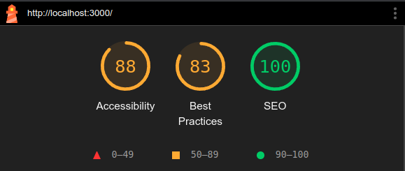

# Carshop

# Índice

- [Carshop](#carshop)
- [Índice](#índice)
- [Introdução](#introdução)
- [Principais tecnologias utilizadas](#principais-tecnologias-utilizadas)
- [Demonstração](#demonstração)
- [Como executar o projeto](#como-executar-o-projeto)
  - [Pré-requisitos](#pré-requisitos)
  - [Como rodar a aplicação](#como-rodar-a-aplicação)
  - [Como rodar a aplicação sem Docker](#como-rodar-a-aplicação-sem-docker)
  - [Login administrativo](#login-administrativo)
- [Como executar os testes](#como-executar-os-testes)
  - [Backend](#backend)
  - [Frontend](#frontend)
- [Lighthouse](#lighthouse)

# Introdução

Bem-vindo ao Carshop, um sistema de catálogo de carros a venda. Com o [login administrativo](#login-administrativo) é possível cadastrar, editar e excluir carros do sistema.

O Backend foi desenvolvido seguindo a arquitetura DDD (Domain Driven Design), SOLID e Clean Code. Visando a escalabilidade, manutenibilidade e testabilidade do sistema.

O Frontend foi desenvolvido tendo em mente boas práticas, componentes reutilizáveis e experiência do usuário.

# Principais tecnologias utilizadas

<strong>Backend:</strong> C#, ASP.NET Core 6.0, Entity Framework Core 6.0, BCrypt, Docker, XUnit, FluentAssertions.

<strong>Frontend:</strong> React + Vite + TypeScript, Tailwind CSS, Axios, React-cookie, React-router-dom, Yup, Docker, Vitest.

<strong>Banco de dados:</strong> SQL Server. (Dockerizado para facilitar a execução do projeto).

# Demonstração

<details open>
  <summary>GIF de demonstração</summary>

  
</details>

# Como executar o projeto

## Pré-requisitos

- Docker
- Docker Compose
- Git
- .NET 6.0 (Para rodar os testes do backend)
- Node.js (Para rodar os testes do frontend)

Para rodar o projeto sem Docker, veja [como rodar a aplicação sem Docker](#como-rodar-a-aplicação-sem-docker).

## Como rodar a aplicação

Clonar o repositório:

```bash
git clone git@github.com:Brendon-Lopes/carshop.git
```

Entrar na pasta do projeto:

```bash
cd carshop
```

Rodar com docker compose (Pode demorar um pouco pra iniciar):

```bash
docker-compose up -d
```

O projeto estará disponível em http://localhost:3000

A API estará disponível em http://localhost:5000

A documentação da API estará disponível em http://localhost:5000/swagger

## Como rodar a aplicação sem Docker

<details>
  <summary>
    <strong>Backend (Clique para expandir)</strong>
  </summary>

Requisitos:

- .NET 6.0
- Banco de dados SQL Server

1. Tenha um banco de dados SQL Server rodando.

   <br />

2. Entre na pasta do backend:

```bash
cd carshop/server
```

3. Edite a connection string no arquivo `appsettings.json` e `appsettings.Development.json` dentro de Carshop.API, de acordo com o seu banco de dados:

- exemplo:

```json
// ...
"ConnectionStrings": {
  "DefaultConnection": "Server=localhost;Database=carshop;User Id=sa;Password=123456;"
}
// ...
```

4. Instale as dependências:

```bash
dotnet restore
```

5. Rode a aplicação:

```bash
dotnet run --project ./src/Carshop.API/Carshop.API.csproj
```

<i> A API vai criar o banco de dados e populá-lo automaticamente.</i>

6. A API estará disponível em http://localhost:5146/swagger

</details>

<details>
  <summary>
    <strong>Frontend (Clique para expandir)</strong>
  </summary>

Requisitos:

- Node.js

1. Entre na pasta do frontend:

```bash
cd carshop/client
```

2. Instale as dependências:

```bash
npm install
```

3. Rode a aplicação:

```bash
npm run dev
```

</details>

## Login administrativo

Email:

```bash
admin@mail.com
```

Senha:

```bash
123456
```

# Como executar os testes

## Backend

Entrar na pasta do projeto:

```bash
cd server
```

Executar os testes:

```bash
dotnet test
```

## Frontend

Entrar na pasta do projeto:

```bash
cd client
```

Instalar as dependências:

```bash
npm install
```

Executar os testes:

```bash
npm test
```

# Lighthouse

Notas de acessibilidade, melhores práticas e SEO do Frontend, de acordo com o Lighthouse:


